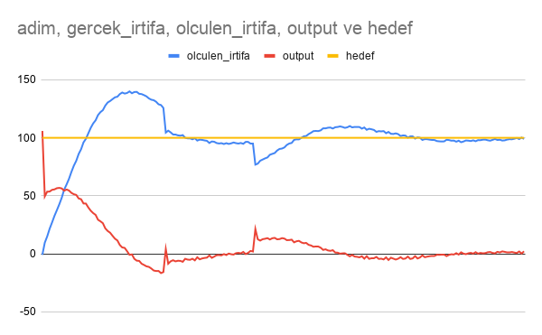

# PID Kontrolcü Simülasyonu

C++ ile yazılmış drone irtifa kontrol simülasyonu.

## Özellikler
- PID kontrol algoritması (Proportional, Integral, Derivative)
- Gerçekçi sensör gürültüsü simülasyonu
- Rastgele zamanlı rüzgar etkisi
- CSV formatında veri kaydı

## Kullanılan Teknolojiler
- C++17
- CMake
- MinGW

## Nasıl Çalışır?
Drone 0 metreden kalkış yaparak 100 metre hedef irtifaya ulaşmaya çalışır.
PID algoritması sensör gürültüsü ve ani rüzgar etkisine rağmen
irtifayı sabit tutmaya çalışır.

## Sonuçlar

## Parametreler
| Parametre | Değer |
|-----------|-------|
| Kp | 1.0 |
| Ki | 0.1 |
| Kd | 0.05 |
| Hedef irtifa | 100m |
| Simülasyon süresi | 200 adım / 20 saniye |
